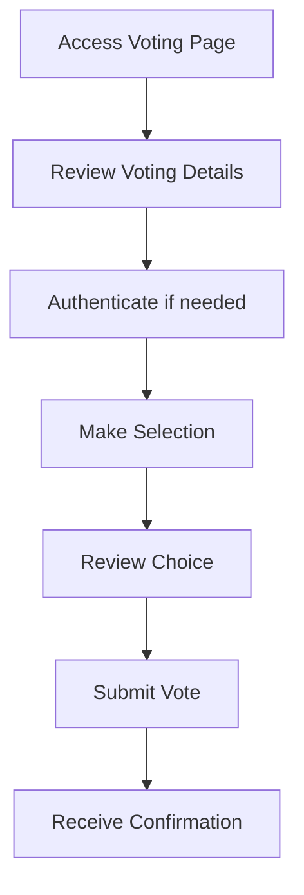

# Voting Process and User Flows

This document describes the voting process and user flows in the Volis application.

## Voter Flow

### 1. Accessing the Platform

1. Visit the Volis platform
2. View the interactive Estonia map
3. See active votings in different municipalities
4. Login with Estonian ID (if required for voting)

### 2. Finding Votings

Users can find votings in multiple ways:
- Through the interactive map
- Via the active votings list
- Through direct links
- By municipality search

### 3. Voting Process



### 4. Vote Verification

After voting:
- Receive confirmation number
- View voting receipt
- Check voting status
- View preliminary results (if enabled)

## Administrator Flow

### 1. Voting Management

Administrators can:
- Create new votings
- Set voting parameters
- Manage voting status
- Monitor participation

### 2. Creating a New Voting

Required information:
```typescript
interface VotingCreation {
  title: string;
  description: string;
  type: 'NORMAL' | 'YOUTH_COUNCIL' | 'REFERENDUM';
  startDate: Date;
  endDate: Date;
  eligibilityCriteria?: {
    minimumAge?: number;
    residencyRequired?: boolean;
    specialRequirements?: string[];
  };
  options: Array<{
    id: string;
    title: string;
    description: string;
  }>;
}
```

### 3. Monitoring and Results

Administrators have access to:
- Real-time participation statistics
- Demographic data (if applicable)
- Voting patterns
- Issue reporting and resolution

## Municipality Management

### 1. Municipality Setup

Required information:
```typescript
interface MunicipalitySetup {
  name: string;
  code: string;
  boundaries: GeoJSON;
  administrators: Array<{
    name: string;
    email: string;
    role: 'ADMIN' | 'SUPER_ADMIN';
  }>;
}
```

### 2. Municipality Dashboard

Features available:
- Active votings overview
- Historical voting data
- Participation statistics
- User management

## Security Measures

### 1. Authentication

- Estonian ID integration
- Role-based access control
- Session management
- Activity logging

### 2. Vote Security

```typescript
interface VoteSecurity {
  // Encryption of votes
  encryptionMethod: 'AES-256';
  // Double-hashing for vote verification
  verificationHash: string;
  // Timestamp for audit
  timestamp: Date;
  // Anonymous voter ID
  anonymousId: string;
}
```

### 3. Audit Trail

All critical actions are logged:
- Voting creation/modification
- Vote submission
- Administrative actions
- System access

## Error Handling

### 1. User Errors

Common scenarios:
- Invalid voting attempts
- Session timeouts
- Duplicate votes
- Missing information

### 2. System Errors

Handling of:
- Database connection issues
- Authentication service failures
- External service integration problems
- Network connectivity issues

## Best Practices

### 1. Voting Creation

- Clear, concise voting titles
- Detailed descriptions
- Appropriate voting duration
- Clear eligibility criteria

### 2. User Communication

- Automatic email notifications
- Status updates
- Result announcements
- Important deadlines

### 3. Data Management

- Regular backups
- Data retention policies
- Privacy compliance
- Access control reviews

## Integration Points

### 1. External Services

- Estonian ID authentication
- Email service
- SMS notifications
- Geographic data services

### 2. API Integration

```typescript
interface ExternalIntegration {
  service: 'AUTH' | 'EMAIL' | 'SMS' | 'GEO';
  endpoint: string;
  method: 'GET' | 'POST' | 'PUT' | 'DELETE';
  authentication: {
    type: 'API_KEY' | 'OAuth2' | 'JWT';
    credentials: string;
  };
}
```

For detailed API documentation and integration guides, refer to the API documentation section.
